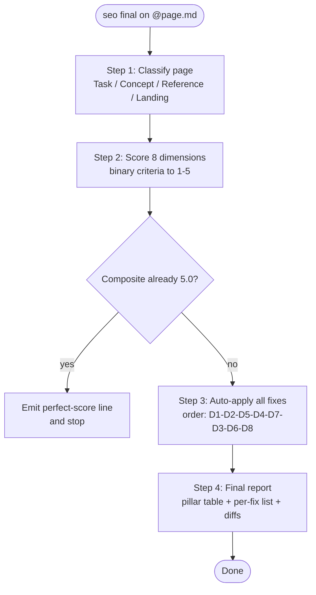

# SAG — SEO + AEO + GEO Documentation Skill (`seo-final`)

A Cursor agent skill that audits JFrog ReadMe-style markdown documentation for **SEO** (search), **AEO** (answer engines / RAG), and **GEO** (generative / citation use), then auto-applies fixes and produces a single before/after report.

---

## What

`seo-final` is a single-shot documentation auditor + rewriter. Point it at a markdown page and it will:

1. Classify the page (Task / Concept / Reference / Landing).
2. Score the page on 8 binary-criteria dimensions across SEO, AEO, and GEO.
3. **Auto-apply** every fix for any dimension below 5/5 — no per-fix prompting.
4. Re-score and emit a unified report with pillar+composite before/after, a per-fix one-liner summary, and collapsible diff blocks.

It is tuned for JFrog docs on ReadMe (frontmatter, JSX components like `<Table>` / `<Callout>` / `<Anchor>` / `<Tabs>`), but the rubric and rewrite templates apply to any similar markdown doc stack.

### Pillars and dimensions

| Pillar | # | Dimension | Criteria |
|--------|---|-----------|----------|
| **SEO** | D1 | Meta description (frontmatter `excerpt`) | 6 |
| | D2 | Heading hierarchy | 6 |
| | D3 | Internal & adjacent linking | 6 |
| | D4 | Structured data (tables / lists / definitions) | 5 |
| **AEO** | D5 | FAQ section | 6 |
| | D6 | RAG chunk quality (section self-containment) | 5 |
| | D7 | Code examples | 6 |
| **GEO** | D8 | Citation-worthy content | 5 |

Total: **45 binary criteria** across 8 dimensions.

---

## How it works

### File layout

```
SAG/
├── SKILL.md                      Source of truth for the workflow + cheat-sheet
└── references/
    ├── scoring-rubrics.md        Deep reference: JSON schemas, before/after examples,
    │                             JFrog product name list, golden page template
    └── rewrite-templates.md      Per-dimension rewrite prompts (D1-D8), used in Step 3
```

The agent can score a page using `SKILL.md` alone. Reference files are read on demand for borderline scoring calls (Step 2) and for the rewrite templates (Step 3).

### The 4-step workflow



#### Step 1 — Classify
Read the target completely. Identify page type from structure and headings:

- **Task** — step-by-step procedure (Prerequisites, Steps, Configuration)
- **Concept** — explanation / architecture (Overview, How it works)
- **Reference** — API / CLI / parameter tables (Syntax, Parameters, Returns)
- **Landing** — hub page linking to children (Getting started, Resources)

Page type drives the dimension weight matrix (`Full` / `Half` / `Skip`).

#### Step 2 — Score
For each dimension, evaluate every binary criterion (e.g. for D1: PRESENCE, LENGTH, ACTION_VERB, PRODUCT_NAME, USER_BENEFIT, NO_FILLER) and map the pass-count to a 1–5 score. Apply page-type weights, then compute:

- **Pillar means** — SEO over D1–D4, AEO over D5–D7, GEO = D8
- **Composite** — weighted mean across all non-Skip dimensions
- **Grade** — A / B / C / D / F (see below)

Skip dimensions are excluded from both the pillar mean and the composite.

#### Step 3 — Auto-apply all fixes
For every dimension scoring below 5 (and not Skip), the skill loads its rewrite template from `references/rewrite-templates.md`, applies it to the page, and re-scores. Fix order is fixed: **D1 → D2 → D5 → D4 → D7 → D3 → D6 → D8** (dependency + impact).

There is no "all / partial / none" prompt — fixes are applied automatically. Every template rule is mandatory: D1 always emits `keywords`, `category`, `metadata.description`; D3 uses **word-count–scaled** internal link targets (4 / 6 / 8) plus contextual inline minimums (2 or 3); D4 forces tables when 3+ parallel items appear in prose; D7 only includes Expected output when source evidence exists (never invented); D8 expands vague references and fixes JFrog product casing without inventing facts.

The skill never:

- Proposes URL slug changes
- Adds a body-visible "Last updated" line (ReadMe handles `date_modified` on the front end)
- Inserts `<!-- TODO: verify -->` placeholders
- Fabricates version numbers, dates, limits, or UUIDs

When verifiable facts are missing, existing wording is left unchanged.

#### Step 4 — Report
Single unified output:

```markdown
## SEO + AEO + GEO Audit Report

**File:** `[filename]`
**Page type:** [Task / Concept / Reference / Landing]
**Audit date:** [today]

### Pillar scores

| Pillar | Before | After | Change |
|--------|--------|-------|--------|
| SEO (D1–D4) | X.X | X.X | +X.X |
| AEO (D5–D7) | X.X | X.X | +X.X |
| GEO (D8)    | X.X | X.X | +X.X |
| **Composite** | **X.X** | **X.X** | **+X.X** |

**Grade: [before-letter] → [after-letter]**

### Fixes applied

- **D1 Meta description** (X/5 → 5/5): rewrote excerpt + added keywords + metadata.description
- **D3 Internal & adjacent linking** (X/5 → 5/5): added 6 links + Related Topics with adjacency
- ...

### Diffs

<details>
<summary>D1 — Meta description</summary>

**Before** ... **After** ...
</details>
<!-- one <details> block per applied fix, in fix-priority order -->
```

### Grading scale

| Composite | Grade | Meaning |
|-----------|-------|---------|
| 4.5–5.0 | **A** | Citation-ready |
| 3.5–4.4 | **B** | Strong; quick fixes |
| 2.5–3.4 | **C** | Several gaps |
| 1.5–2.4 | **D** | Major restructuring |
| 1.0–1.4 | **F** | Critical gaps |

### Page-type weight matrix

| # | Dimension | Task | Concept | Reference | Landing |
|---|-----------|------|---------|-----------|---------|
| D1 | Meta description | Full | Full | Full | Full |
| D2 | Heading hierarchy | Full | Full | Full | Full |
| D3 | Internal & adjacent linking | Full | Full | Half | Full |
| D4 | Structured data | Full | Full | Full | Half |
| D5 | FAQ section | Full | Full | **Skip** | Half |
| D6 | RAG chunk quality | Full | Full | Full | Half |
| D7 | Code examples | Full | Half | Full | **Skip** |
| D8 | Citation-worthy | Full | Full | Full | Half |

`Full` = weight 1.0. `Half` = scored but weighted 0.5. `Skip` = excluded from composite.

---

## How to use

### Install the skill

The skill must live at `~/.cursor/skills/seo-final/` so Cursor loads it. Either copy the `SAG/` contents into that path, or symlink:

```sh
# Copy
cp -R SAG/SKILL.md SAG/references ~/.cursor/skills/seo-final/

# Or symlink (lets edits in SAG/ propagate immediately)
ln -s "$(pwd)/SAG" ~/.cursor/skills/seo-final
```

The install needs only `SKILL.md` + `references/` — nothing else. New chats pick up the skill automatically; restart any open chat to reload.

### Trigger the skill

In any Cursor chat, the explicit trigger phrase is **`seo final`**:

```
seo final on @path/to/page.md
```

The skill also activates on natural-language asks like "Run an SEO/AEO/GEO audit on this page", "AI-ready this doc", "doc quality report".

### Common usage patterns

| You want | What to type / attach |
|----------|------------------------|
| Audit + auto-fix one page | `seo final on @page.md` (drag the file into the chat) |
| Audit + auto-fix a folder | `seo final on @folder/` — processed up to 5 markdown files per batch; the skill summarizes then offers the next batch |
| Audit pasted markdown | Paste the markdown content directly into chat — you get the full report and the proposed full-page output, but no on-disk edits (no file to write to) |
| Scoped audit | "Audit only the FAQ section of `@page.md`" or specify a line range — scoring may still need the full page for some dimensions; say what scope you want |
| Just the score, no fixes | "Score `@page.md` but do not apply fixes" — the skill will report Step 2 only |

### Batch mode

When given a folder, the skill processes up to 5 files per batch:

```
| File | Type | Before | After | Change | Grade | Top issue fixed |
|------|------|--------|-------|--------|-------|-----------------|
| docker-repos.md  | Task    | 2.4 | 5.0 | +2.6 | A | D3 Linking 1/5 → 5/5 |
| docker-rest.md   | Ref     | 3.1 | 4.7 | +1.6 | A | D7 Expected output |
| ...              | ...     | ... | ... | ...  | … | ...                  |
```

After each batch the skill offers the next 5 files. Full per-file reports are available on request.

### Behavioral expectations

- **Single-shot.** Steps 3 and 4 don't ask for permission; the skill scores, auto-applies all fixes, then emits one report.
- **Perfect-score shortcut.** If Step 2 already scores composite 5.0 with all dimensions at 5/5, the skill skips Step 3 and emits a single confirmation line.
- **JSX/HTML preserved.** `<Table>`, `<Callout>`, `<Anchor>`, `<Tabs>` and their attributes are never modified.
- **D7 exemption.** Concept-only pages without procedures score 5/5 on D7 without code blocks.
- **D5 short-page floor.** Pages with under 200 words of body get a minimum FAQ score of 3 — small pages aren't crushed by structural rules.
- **Half-weight dimensions** still get scored 1–5 and appear in the breakdown, but contribute 0.5× to the composite.
- **Skip dimensions** show `N/A` for both score and pass count and are excluded from composite + pillar means.

### Templates and criteria

Every fix in Step 3 comes from one of the 8 rewrite templates in [`references/rewrite-templates.md`](references/rewrite-templates.md). Each template lists every rule mandatorily — there are no optional fields. Every binary criterion is documented in [`references/scoring-rubrics.md`](references/scoring-rubrics.md) with:

- Scanning rules
- A JSON output schema (machine-readable per-criterion result)
- Before/after fix examples
- Borderline-judgment guidance

The JFrog product name reference (D8 PRODUCT_NAMES) and the golden page template both live in `scoring-rubrics.md` as well.

---

## License

MIT
